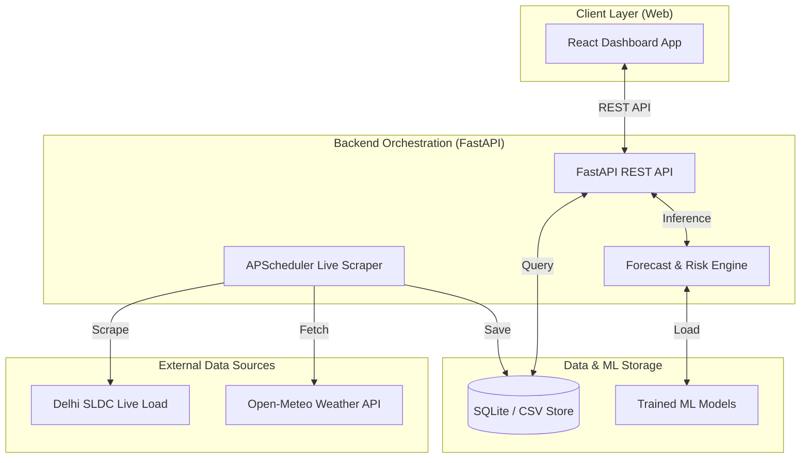

# ⚡ GridForecast AI: Real-Time Delhi Electricity Demand Forecasting

<div align="center">
  <br/><br/>
  
  [](https://opensource.org/licenses/MIT)
  [](https://reactjs.org/)
  [](https://fastapi.tiangolo.com/)
  [](https://scikit-learn.org/)
  [](https://grid-forecast-ai-five.vercel.app/)
  <br/>
  **Predicting electricity demand for Delhi in real-time using live SLDC data, Open-Meteo weather APIs, and advanced ML forecasting models.**
</div>

---

## 🌟 Overview

**GridForecast AI** is a full-stack, production-ready platform designed to forecast and monitor electricity demand and grid health. By ingesting live weather data and real-time load from Delhi's State Load Despatch Centre (SLDC), it provides robust predictions using trained Machine Learning models to alert grid operators of potential stress before it happens.

### 🚀 Key Value Propositions
- **Real-Time Accuracy:** Scrapes live Delhi grid data every 15 minutes and pulls real-time weather from Open-Meteo.
- **Advanced Forecasting:** Uses an ensemble of ML models (RandomForest, GradientBoosting, XGBoost, etc.) to predict demand for the next 1h, 2h, 24h, and 7-days.
- **Grid Risk Analysis:** Automatically flags grid stress (Normal, Elevated, High, Critical, Capacity Exceeded) to prevent blackouts.
- **Dynamic Solar Estimation:** Solar generation is estimated on-the-fly based on live solar radiation metrics from real weather APIs.

---

## 🏗️ System Architecture

GridForecast AI leverages a modern, distributed architecture designed for real-time monitoring and fast ML inference.



### 🧩 Core Component Roles

| Component | Technology | Description |
| :--- | :--- | :--- |
| **Backend API** | FastAPI | High-performance Python backend serving live data, forecasts, and model metrics. |
| **Live Scraper** | APScheduler + BS4 | Periodically scrapes real Delhi load and fetches current weather/solar conditions. |
| **ML Engine** | Scikit-Learn / XGBoost | Automatically evaluates and serves the best-performing model (e.g., Random Forest). |
| **Frontend UI** | React + Vite | Real-time dashboards with responsive charts and grid risk visualization. |

---

## 🔄 Data Flows & Real-Time Sources

### Are the Load and Solar Data Real?
**Yes, absolutely.**
- **Load (Demand):** Scraped directly in real-time from [Delhi SLDC (delhisldc.org)](https://delhisldc.org) and its API endpoints.
- **Solar Generation:** Calculated in real-time based on actual physical `solar_radiation`, `cloud_cover`, and `temperature` metrics pulled directly from the [Open-Meteo API](https://open-meteo.com). 

| Data Type | Source | Real-Time? |
|---|---|---|
| **Delhi Demand (Historical)** | delhisldc.org API | ✅ Yes |
| **Delhi Demand (Live)** | delhisldc.org Scraper (every 15 min) | ✅ Yes |
| **Weather & Solar (Historical)** | archive-api.open-meteo.com | ✅ Yes |
| **Weather & Solar (Forecast)** | api.open-meteo.com | ✅ Yes |
| **Grid Capacity** | Assumed baseline plant data | ⚠️ Estimated |

---

## 💻 Technical Implementation

### Backend Strategy
- **Asynchronous Scraping:** Background workers seamlessly gather live data without interrupting the API responsiveness.
- **Multi-Model Registry:** 7+ ML models (RandomForest, XGBoost, etc.) are trained automatically; the backend selects the one with the lowest RMSE.
- **RESTful Endpoints:** Standardized JSON outputs for forecasting (`/api/predict/horizons`), real-time snapshots (`/api/live/snapshot`), and risk alerts.

### Frontend Excellence
- **Real-time Dashboards:** Multi-page layout covering Demand Forecasts, Live Snapshot, Area-specific breakdowns, and ML Model Comparisons.
- **Responsive Charts:** Powered by Recharts/Chart.js to fluidly display historical trends alongside future predictions.

---

## 📁 Project Structure

```text
electricity-demand-forecast/
├── backend/               # FastAPI Application
│   ├── api/               # API endpoints & routers
│   ├── data/              # Delhi SLDC scraper, Weather collector, Data processors
│   ├── engine/            # Forecaster and Grid Risk Engine
│   ├── models/            # ML models (RandomForest, XGBoost, CNN/LSTM fallback)
│   └── utils/             # Database access and logging config
├── frontend/              # React Dashboard Application
│   └── src/
│       ├── pages/         # 8 diverse dashboard views (Live, Demand, Risk, etc.)
│       ├── components/    # Reusable UI charts and stat cards
│       ├── hooks/         # Data fetching hooks
│       └── api/           # Axios client definitions
├── data/                  
│   ├── raw/               # Downloaded historical and live CSV datasets
│   └── models/            # Serialized ML model binaries (.joblib)
├── scripts/               # Automation scripts
│   ├── setup.sh           # One-click installer
│   ├── start.sh           # One-click runner
│   └── download_real_data.py
├── requirements.txt       # Python dependencies
└── README.md              # Project documentation
```

---

## 🛠️ Setup & Development

### Prerequisites
- **Python 3.10 - 3.12** *(Note: Python 3.13/3.14 works, but skips CNN/LSTM due to TF compatibility)*
- **Node.js 18+**

### Quick Start (One-Click)

#### macOS / Linux
```bash
cd electricity-demand-forecast
bash scripts/setup.sh
bash scripts/start.sh
```

#### Windows (Command Prompt)
```cmd
cd electricity-demand-forecast
scripts\setup.bat
scripts\start.bat
```
*Access the dashboard at **http://localhost:3000***

### Manual Start

1. **Backend:**
   ```bash
   cd electricity-demand-forecast
   venv/bin/python -m uvicorn backend.api.main:app --reload --port 8000
   ```
2. **Frontend:**
   ```bash
   cd electricity-demand-forecast/frontend
   npm start
   ```

---

## 🚀 Deployment Guide

### Option 1: Modern Cloud (Vercel + Render)
**Backend (Render):**
1. Connect your repository to Render as a New Web Service.
2. Set Build Command to: `pip install -r requirements.txt`
3. Set Start Command to: `uvicorn backend.api.main:app --host 0.0.0.0 --port $PORT`
*Pro-tip: Use [UptimeRobot](https://uptimerobot.com) to ping your `https://your-render-url.onrender.com/health` endpoint every 5 minutes so the free tier never sleeps!*

**Frontend (Vercel):**
1. Import repository to Vercel.
2. Set Root Directory to `frontend`.
3. Add environment variable `REACT_APP_API_URL` pointing to your Render backend URL.

### Option 2: VPS / Docker
A `Dockerfile` and `docker-compose.yml` can be added to easily spin up the full stack on any DigitalOcean/AWS EC2 Ubuntu server.

---

<div align="center">
  <p>Built for a resilient energy future</p>
  
  
</div>
